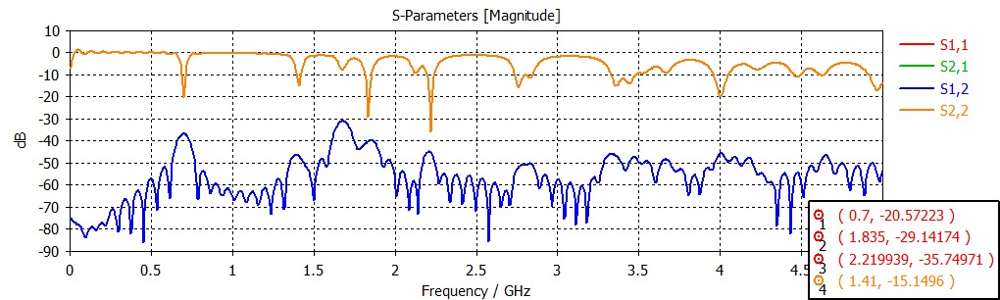
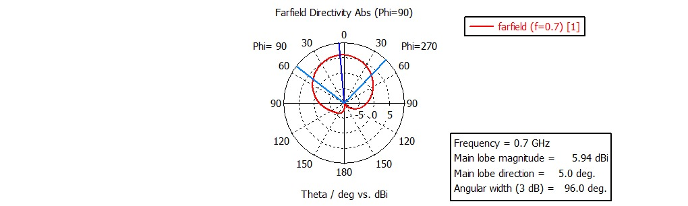
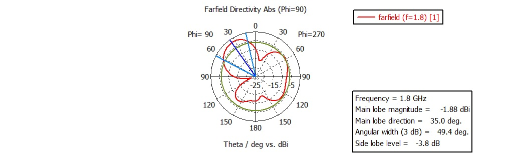
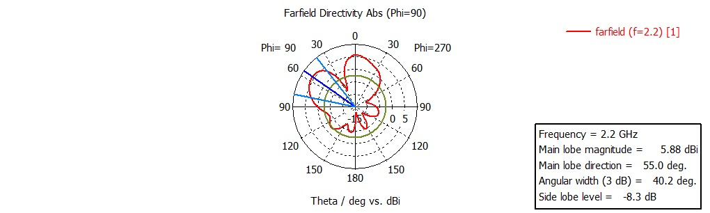
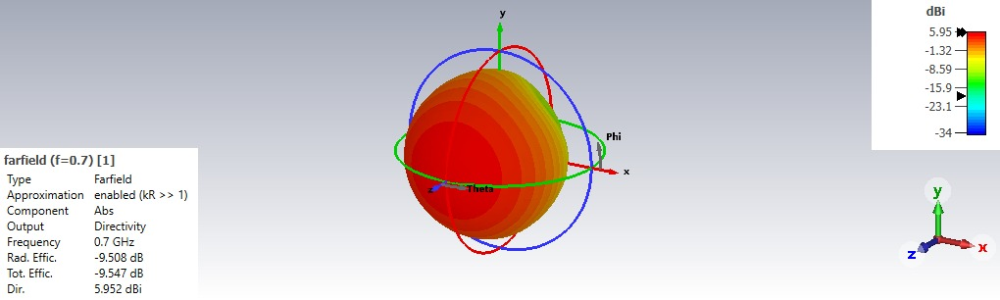

## CST Simulation Results

The following results were obtained from the CST electromagnetic simulation
of the antenna design.

### 1. S-Parameter Results

The simulated S-parameter response was evaluated over the frequency range
shown in the CST plot.

#### Marked S-Parameter Values

| Frequency | Marked Value |
|---:|---:|
| 0.700 GHz | -20.57223 dB |
| 1.410 GHz | -15.1496 dB |
| 1.835 GHz | -29.1474 dB |
| 2.219939 GHz | -35.74971 dB |

These values are the marked points displayed in the CST S-parameter plot.

---

### 2. Far-Field Result at 0.7 GHz

The CST far-field plot at **0.7 GHz** shows:

| Parameter | Result |
|---|---:|
| Frequency | 0.7 GHz |
| Main lobe magnitude | 5.94 dBi |
| Main lobe direction | 5° |
| 3 dB angular width | 96.0° |

---

### 3. Far-Field Result at 1.8 GHz

The CST far-field plot at **1.8 GHz** shows:

| Parameter | Result |
|---|---:|
| Frequency | 1.8 GHz |
| Main lobe magnitude | -1.88 dBi |
| Main lobe direction | 35° |
| 3 dB angular width | 49.4° |
| Side lobe level | -3.8 dB |

---

### 4. Far-Field Result at 2.2 GHz

The CST far-field plot at **2.2 GHz** shows:

| Parameter | Result |
|---|---:|
| Frequency | 2.2 GHz |
| Main lobe magnitude | 5.88 dBi |
| Main lobe direction | 55° |
| 3 dB angular width | 40.2° |
| Side lobe level | -8.3 dB |

---

### 5. 3D Far-Field Result at 0.7 GHz

The CST 3D far-field result at **0.7 GHz** shows:

| Parameter | Result |
|---|---:|
| Frequency | 0.7 GHz |
| Directivity | 5.952 dBi |
| Radiation efficiency | -9.508 dB |
| Total efficiency | -9.547 dB |

---

## Simulation Result Summary

| Analysis | Frequency | Key Result |
|---|---:|---|
| S-Parameter | 0.700 GHz | -20.57223 dB marked value |
| S-Parameter | 1.410 GHz | -15.1496 dB marked value |
| S-Parameter | 1.835 GHz | -29.1474 dB marked value |
| S-Parameter | 2.219939 GHz | -35.74971 dB marked value |
| Far-Field | 0.7 GHz | 5.94 dBi main lobe |
| Far-Field | 1.8 GHz | -1.88 dBi main lobe |
| Far-Field | 2.2 GHz | 5.88 dBi main lobe |
| 3D Far-Field | 0.7 GHz | 5.952 dBi directivity |

## Result Interpretation

The CST plots provide the current electromagnetic simulation evidence for
the antenna design. The results include S-parameter response, 2D far-field
patterns, and a 3D far-field visualization.

The marked S-parameter values and far-field parameters are reported directly
from the available CST result plots. Further optimization and experimental
validation can be performed after integrating the antenna with the helmet
geometry and proposed AMC structure.

## Validation Plan

The next validation stages are:

1. Optimize the antenna geometry based on the simulation response.
2. Evaluate the antenna on the curved helmet surface.
3. Analyze the effect of the AMC/RF shielding layer.
4. Evaluate array-level mutual coupling.
5. Fabricate the antenna prototype.
6. Measure S-parameters using a VNA.
7. Compare simulated and measured results.
