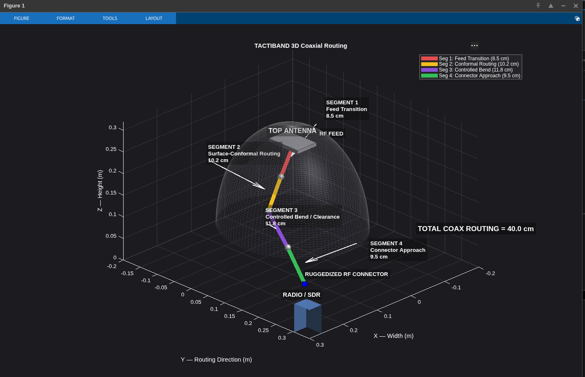

# TactiBand 3D Coaxial Routing

## Overview

MATLAB-based 3D visualization of the proposed TactiBand RF coaxial routing path.

The model includes the top antenna, RF feed point, four coaxial routing segments, ruggedized RF connector, and Radio/SDR.

## Routing Configuration

| Segment | Length | Purpose |
|---|---:|---|
| Segment 1 | 8.5 cm | Feed Transition |
| Segment 2 | 10.2 cm | Surface-Conformal Routing |
| Segment 3 | 11.8 cm | Controlled Bend / Clearance |
| Segment 4 | 9.5 cm | Connector Approach |
| **Total** | **40.0 cm** | **Complete RF Routing Path** |

## Routing Length Calculation

L_total = L1 + L2 + L3 + L4

L_total = 8.5 + 10.2 + 11.8 + 9.5

**L_total = 40.0 cm**

## Segment Purpose

- **Segment 1:** Feed transition from the top antenna.
- **Segment 2:** Surface-conformal routing section.
- **Segment 3:** Controlled bend and clearance section.
- **Segment 4:** Final connector approach.

## Key Routing Factors

1. Short RF path
2. Controlled bend radius
3. RF clearance
4. Secure RF termination

## MATLAB 3D Output

## Validation Parameters

The proposed routing geometry can be evaluated using:

- Cable attenuation
- S11 — impedance matching
- S21/S12 — coupling/isolation
- Radiation pattern
- Gain
- Efficiency
- VNA measurement
  
