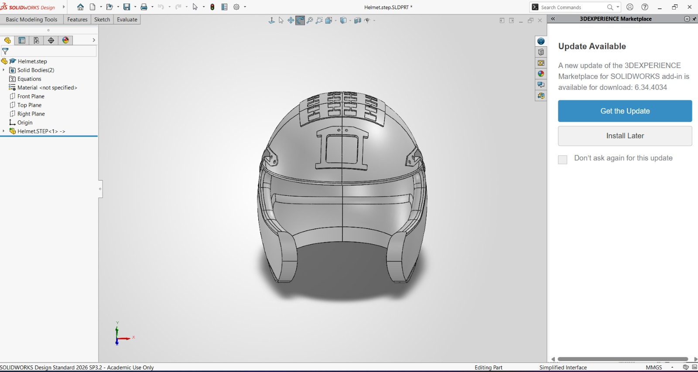
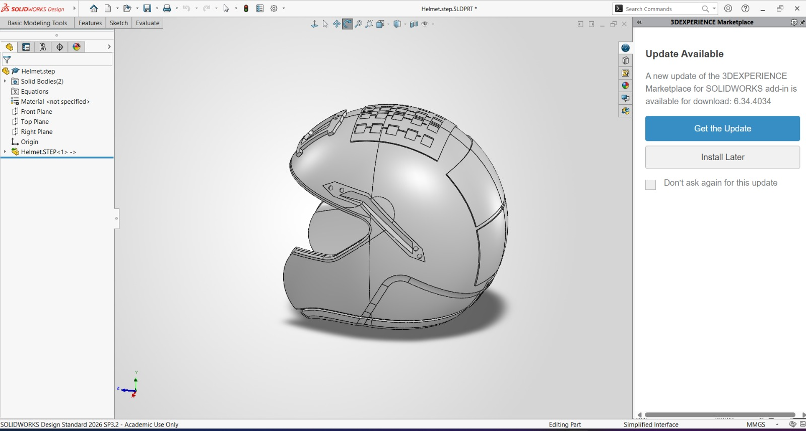
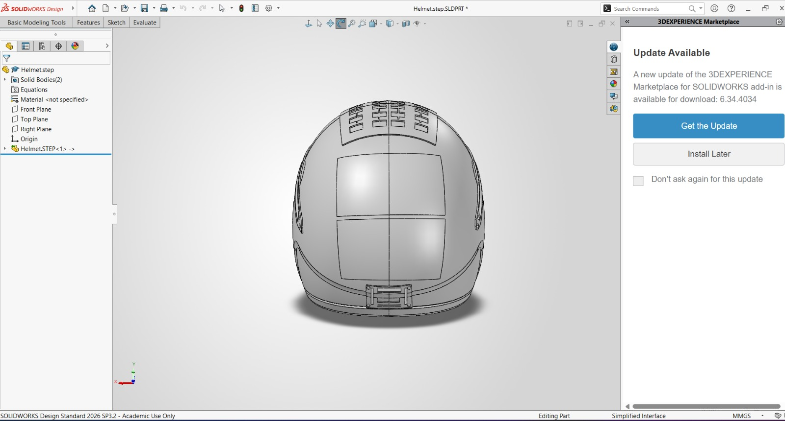
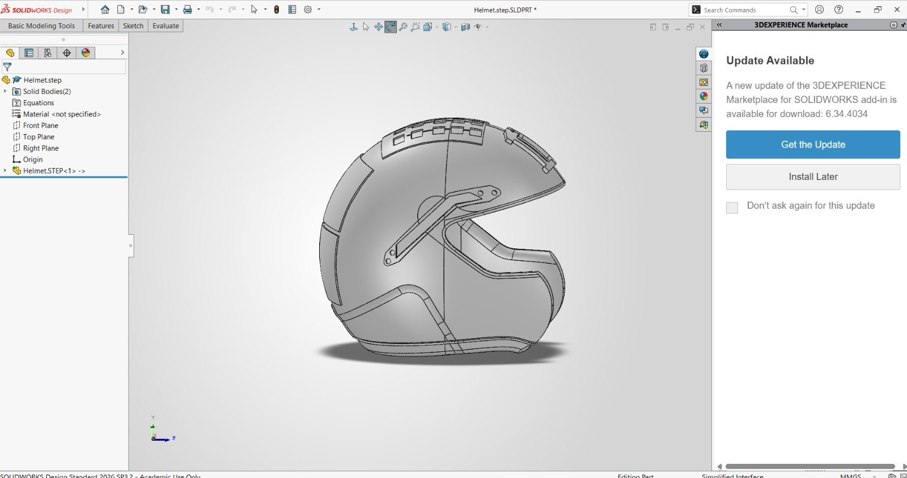

# TACTIBAND Helmet CAD Design

## Overview

This directory contains the helmet CAD design developed by Team PHONEX for the TACTIBAND helmet-mounted conformal antenna architecture.

The CAD model demonstrates the proposed integration of the conformal antenna array onto the helmet surface while maintaining a low-profile configuration.

## Design Objectives

- Helmet-conformal antenna integration
- Low-profile antenna placement
- Reduced protruding hardware
- Integration of the antenna array with the helmet geometry
- Provision for RF cable/coaxial routing
- Support for the overall TACTIBAND RF architecture

## CAD Software

## CAD Views
## CAD Views

The following views show the team-developed helmet CAD model and the
proposed TACTIBAND antenna integration.

### Front View

### Side View

### Rear View

### Isometric View

These CAD views demonstrate the helmet geometry and the placement of the
proposed conformal antenna elements on the upper helmet surface.

## Design Components

The current CAD concept includes:

1. Helmet body
2. Front protection structure
3. Side helmet structures
4. Upper helmet antenna integration region
5. Conformal antenna elements
6. Mounting/interface features

## Antenna Integration

The antenna elements are positioned on the upper helmet surface as part of the proposed TACTIBAND conformal-array architecture.

The placement is intended to provide a low-profile antenna configuration suitable for helmet integration.

## CAD Views

The `images/` directory contains different views of the helmet CAD model:

- Front view
- Side view
- Rear view
- Isometric view
